# TP de Synthèse – Client TFTP

**Mayane GUILLON et Rania DOUIA**

## Question 1 : Optimisation des Requêtes TFTP avec gettftp et puttftp
*Objectif: vérifier la validité des arguments de ligne de commande pour les clients gettftp et puttftp et afficher les informations associées en cas de saisie correcte.*

Le code écrit gère deux clients en ligne de commande, gettftp et puttftp, pour le transfert de fichiers via le protocole TFTP. 

Il vérifie simplement si le nombre d'arguments est correct (4 : alt256 srvtinfo1.ensea.fr 69), affichant un message d'erreur sinon. 

S'il est correct, il extrait et affiche les informations nécessaires (nom de fichier, hôte, port) pour vérification. 

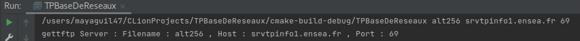

## Question 2 :
*Objectif: préparer la connexion au serveur TFTP en résolvant l'adresse à partir du nom d'hôte et du numéro de port, en utilisant la fonction getaddrinfo.*

Cette question concerne la résolution de l'adresse du serveur à partir du nom d'hôte et du numéro de port fournis en ligne de commande. 

Pour ce faire, le programme utilise la fonction getaddrinfo, qui prend en compte des informations spécifiques sur la configuration du socket à travers la structure hints. 

Cette fonction permet de préparer une structure d'informations sur l'adresse du serveur, qui sera utilisée ultérieurement pour établir une connexion avec le serveur TFTP.

Plus précisémment, le code initialise la structure hints avec des paramètres tels que la famille d'adresses (IPv4 dans ce cas), le type de socket, et le protocole à utiliser. 

Ensuite, la fonction getaddrinfo est appelée avec le nom d'hôte ("host") et le numéro de port. Si la résolution de l'adresse est réussie, les informations sont stockées dans la structure result.

Cette partie du code s'occupe de la préparation des informations nécessaires pour établir une connexion avec le serveur TFTP, en convertissant le nom d'hôte en une adresse IP utilisable.

## Question 3 et 4 :
*Objectif: implémenter le transfert de fichiers depuis le serveur TFTP vers le client (gettftp):
(3) Réservation d'un socket de connexion vers le serveur.
(4a)Construction d'une requête en lecture (RRQ) correctement formée et envoi au serveur.
(4b) Réception d'un fichier constitué d'un seul paquet de données (DAT) et son acquittement (ACK).
(4c) Réception d'un fichier constitué de plusieurs paquets de données (DAT) et de leurs acquittements respectifs (ACK).*

Pour cette question, on implémente un client TFTP (gettftp) qui utilise le protocole TFTP pour télécharger un fichier depuis un serveur TFTP distant.

* **Initialisation et Résolution d'Adresse :**

Le programme commence par vérifier la validité des arguments de ligne de commande.

Il résout l'adresse du serveur à l'aide de la fonction getaddrinfo, comme expliqué précédemment.

* **Construction et Envoi de la Requête RRQ :**

Une fois l'adresse du serveur résolue, le programme construit une requête de lecture (Read Request - RRQ) en utilisant le nom du fichier passé en ligne de commande.

Un socket est créé pour la communication avec le serveur.

La requête RRQ est envoyée au serveur à l'aide de la fonction sendto.

* **Réception et Traitement des Paquets de Données :**

Le programme entre ensuite dans une boucle où il attend de recevoir des paquets de données du serveur à l'aide de la fonction recvfrom.

Chaque paquet de données reçu est traité. Les données utiles (le contenu du fichier) sont extraites du paquet et écrites dans un fichier local sur le client.

Format des donnée (valeurs du opcode)
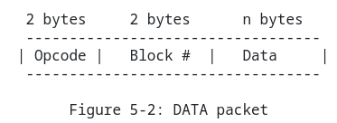 
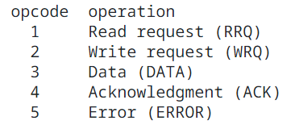

Un accusé de réception (ACK) est envoyé au serveur pour confirmer la réception du paquet de données.

Format du ACK :
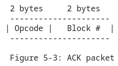

* **Gestion des Paquets de Données Multiples :**

Si le fichier à télécharger nécessite plusieurs paquets, le programme répète le processus de réception et d'accusé de réception jusqu'à ce que tous les paquets soient reçus.

La boucle continue jusqu'à ce qu'un paquet de données reçu soit de taille inférieure à la taille maximale autorisée (516 octets), indiquant la fin du transfert.

* **Fermeture du Fichier et du Socket :**

Une fois tous les paquets de données reçus et écrits dans le fichier local, le fichier est fermé.

Le socket est également fermé, et le programme se termine.

En résumé, ces questions illustrent les étapes du protocole TFTP pour établir une connexion avec le serveur, envoyer une requête de lecture, recevoir et écrire les données dans un fichier local, et confirmer la réception de chaque paquet de données.

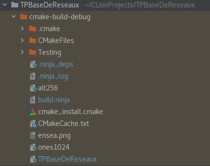
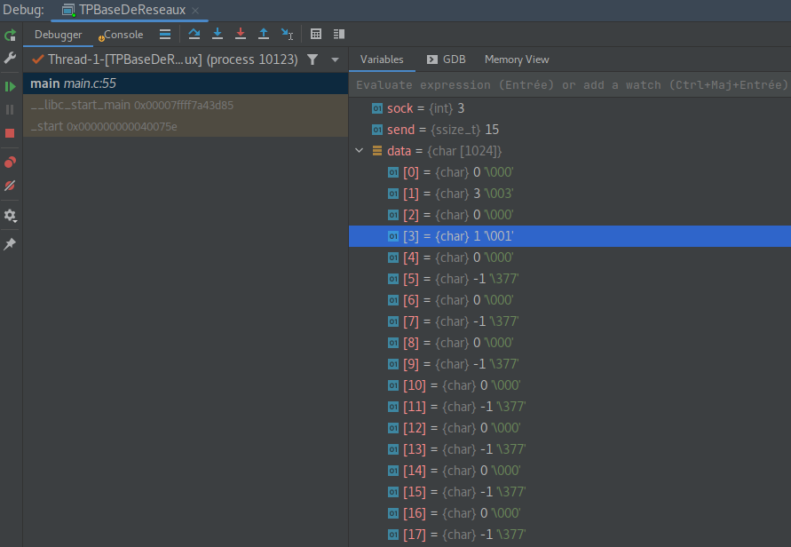
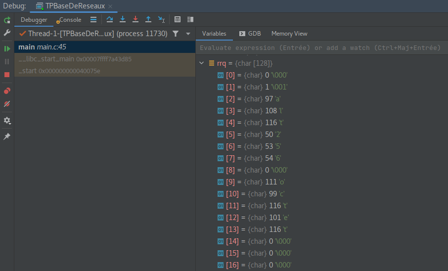
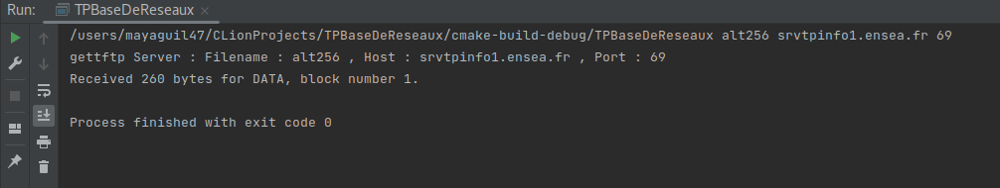
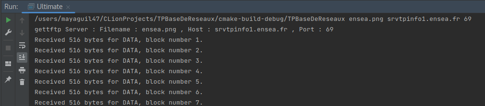
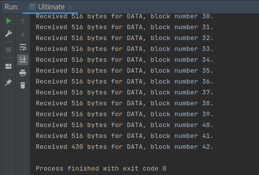
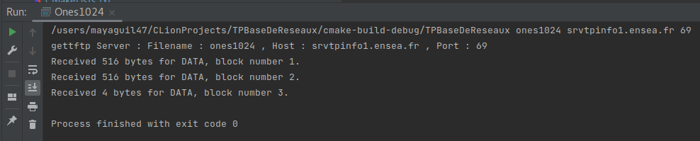
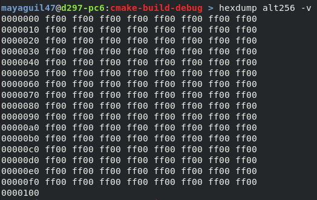
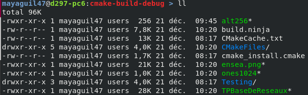

## Question 5 : 
*Objectif:*

## Question 6 : 
*Objectif:*

## Réflexions personnelles
### Mayane GUILLON

### Rania DAOUIA 

